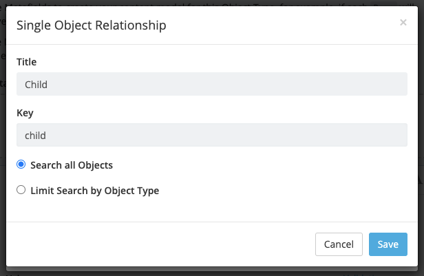

# Create content in cosmicjs

1. Click Add Object Type

2. After filling in your component name, click add new metafield.

3. Select Plain Text Input.

4. Fill in Title with Type and key as type. The value is the name of your component. The type tells the front-end which component is being used.

5. Click again on Add new metafield and select Repeater.

6. Fill in Title and Key with the Children value.

7. Click Add repeater metafield and select Single Object Relationship.

8. Fill in Title and key of Single Object Relationship with Child.

9. You can choose Search all objects to use any component within the component you are using, or choose Limit Search by Object Type to limit which objects can be used within your component.

## Attributes
Components can have multiple attributes. This way we can customize the component and inform how it should be displayed. It is even possible to fine-tune the spacing using classes.

To add attributes to your component:

1. Click Add Object Type

2. Select Parent

3. Fill the title and key with Attributes

4. Click Add Child Metafield

5. Select any of the possible metafields and enter as Title and Key the corresponding value of your component's attribute in the front-end.

